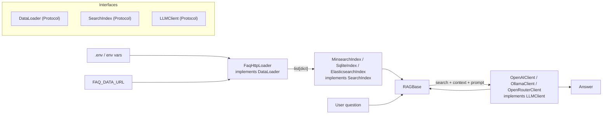

# Design Document: rag-intro

## Overview

Минимальный RAG-проект: загрузка FAQ-данных → построение поискового индекса → поиск → формирование промпта → ответ через OpenAI API. Код живёт в `src/`, ноутбуки импортируют из него.

Два режима работы:
- **in-memory** (minsearch) — для быстрого старта, без персистентности
- **persistent** (sqlitesearch) — индекс сохраняется на диск, повторная загрузка не нужна

---

## Architecture



Три независимо заменяемых компонента, связанных через Protocol-интерфейсы:
- `interfaces.py` — Protocol-классы: `SearchIndex`, `DataLoader`, `LLMClient`
- `ingest.py` — реализации `DataLoader` и `SearchIndex`
- `llm.py` — реализации `LLMClient`
- `rag.py` — RAG-пайплайн, зависящий только от абстракций

---

## Components and Interfaces

### `src/interfaces.py`

Protocol-классы — единственная точка контракта между компонентами. Замена любого компонента не требует изменений в остальном коде.

```python
from typing import Protocol

class SearchIndex(Protocol):
    def search(self, query: str, num_results: int, boost_dict: dict, filter_dict: dict) -> list[dict]: ...

class DataLoader(Protocol):
    def load(self) -> list[dict]: ...

class LLMClient(Protocol):
    def complete(self, prompt: str, instructions: str, model: str) -> str: ...
```

### `src/ingest.py`

Реализации `DataLoader` и `SearchIndex`:

```python
class FaqHttpLoader:          # implements DataLoader
    def __init__(self, url: str | None = None): ...
    def load(self) -> list[dict]: ...

class MinsearchIndex:         # implements SearchIndex
    def __init__(self, docs: list[dict]): ...
    def search(self, query, num_results, boost_dict, filter_dict) -> list[dict]: ...

class SqliteIndex:            # implements SearchIndex
    def __init__(self, docs: list[dict], db_path: str): ...
    def search(self, query, num_results, boost_dict, filter_dict) -> list[dict]: ...

class ElasticsearchIndex:     # implements SearchIndex
    def __init__(self, host: str, index_name: str): ...
    def search(self, query, num_results, boost_dict, filter_dict) -> list[dict]: ...
```

`FaqHttpLoader.load()` читает `FAQ_DATA_URL` из окружения (с дефолтным значением), делает HTTP GET, возвращает плоский список FAQ-документов.

`SqliteIndex` проверяет наличие файла: если существует — загружает, иначе строит и сохраняет.

### `src/llm.py`

Реализации `LLMClient`:

```python
class OpenAIClient:           # implements LLMClient
    def complete(self, prompt: str, instructions: str, model: str) -> str: ...

class OllamaClient:           # implements LLMClient
    def __init__(self, base_url: str = "http://localhost:11434"): ...
    def complete(self, prompt: str, instructions: str, model: str) -> str: ...

class OpenRouterClient:       # implements LLMClient
    def complete(self, prompt: str, instructions: str, model: str) -> str: ...
```

### `src/rag.py`

```python
class RAGBase:
    def __init__(self, index: SearchIndex, llm: LLMClient,
                 model: str = "gpt-4o-mini",
                 prompt_template: str = DEFAULT_TEMPLATE,
                 num_results: int = 5, course_filter: str | None = None): ...

    def search(self, query: str) -> list[dict]: ...
    def build_context(self, results: list[dict]) -> str: ...
    def build_prompt(self, question: str, context: str) -> str: ...
    def ask(self, prompt: str) -> str: ...
    def rag(self, question: str) -> str: ...
```

`RAGBase` зависит только от `SearchIndex` и `LLMClient`. Замена компонентов:

```python
# minsearch + OpenAI
rag = RAGBase(index=MinsearchIndex(docs), llm=OpenAIClient())

# Elasticsearch + Ollama
rag = RAGBase(index=ElasticsearchIndex(host="localhost:9200", index_name="faq"),
              llm=OllamaClient(model="llama3"))
```

### `src/__init__.py`

```python
from .interfaces import SearchIndex, DataLoader, LLMClient
from .ingest import FaqHttpLoader, MinsearchIndex, SqliteIndex, ElasticsearchIndex
from .llm import OpenAIClient, OllamaClient, OpenRouterClient
from .rag import RAGBase
```

---

## Data Models

### FAQ_Document (dict)

| Поле | Тип | Описание |
|------|-----|----------|
| `question` | str | Вопрос |
| `text` | str | Ответ |
| `section` | str | Раздел |
| `course` | str | Название курса |

### Конфигурация окружения

| Переменная | Обязательна | Дефолт |
|------------|-------------|--------|
| `OPENAI_API_KEY` | да | — |
| `FAQ_DATA_URL` | нет | URL датасета LLM Zoomcamp |

---

## Correctness Properties

*A property is a characteristic or behavior that should hold true across all valid executions of a system — essentially, a formal statement about what the system should do. Properties serve as the bridge between human-readable specifications and machine-verifiable correctness guarantees.*

### Property 1: Парсинг FAQ сохраняет обязательные поля

*For any* список FAQ-словарей с полями `question`, `text`, `section`, `course`, каждый документ после парсинга через `load_faq_data` должен содержать все четыре поля с непустыми строковыми значениями.

**Validates: Requirements 1.2**

### Property 2: Поиск возвращает не более N результатов

*For any* индекс с документами и любое значение `num_results = N ≥ 1`, метод `search()` должен возвращать список длиной не более N.

**Validates: Requirements 2.1**

### Property 3: Фильтр по курсу возвращает только совпадающие документы

*For any* набор FAQ-документов с разными значениями поля `course` и любой фильтр `course_filter`, все документы в результатах поиска должны иметь `course == course_filter`.

**Validates: Requirements 2.3**

### Property 4: Промпт содержит контекст и вопрос

*For any* строка контекста и строка вопроса, результат `build_prompt(question, context)` должен содержать оба значения как подстроки.

**Validates: Requirements 3.2**

### Property 5: Контекст строится из результатов поиска

*For any* непустой список результатов поиска, `build_context(results)` должен возвращать непустую строку, содержащую текст хотя бы одного результата.

**Validates: Requirements 3.1**

---

## Error Handling

| Ситуация | Поведение |
|----------|-----------|
| HTTP-запрос за FAQ-данными упал | `raise RuntimeError(f"Failed to fetch FAQ data: {status_code}")` |
| OpenAI API вернул ошибку | Исключение пробрасывается наружу с деталями API-ошибки |
| `db_path` не задан | Используется minsearch (in-memory) |

---

## Testing Strategy

**Инструменты:** `pytest` + `hypothesis` (property-based testing).

**Unit-тесты (pytest):**
- `load_faq_data` с мок-HTTP: успех и ошибка (req 1.1, 1.5)
- `build_index` / `build_sqlite_index`: проверка типа возвращаемого объекта (req 1.3, 1.4)
- `build_sqlite_index` с существующим файлом: загрузка без повторного fetch (req 4.2)
- `RAGBase.llm()` с мок-клиентом: успех и ошибка (req 3.3, 3.4)
- `RAGBase` с обоими типами индексов: одинаковый интерфейс (req 3.5)
- Env-переменные: дефолтный URL, загрузка `.env` (req 5.2, 5.3)
- Импорт из `src/`: `from src import RAGBase, load_faq_data` (req 6.1)

**Property-тесты (hypothesis, минимум 100 итераций каждый):**
- **Property 1** — `@given(st.lists(faq_dict_strategy))` → все поля присутствуют
- **Property 2** — `@given(docs, num_results)` → `len(results) <= num_results`
- **Property 3** — `@given(docs_with_courses, course)` → все результаты совпадают по курсу
- **Property 4** — `@given(st.text(), st.text())` → промпт содержит оба аргумента
- **Property 5** — `@given(st.lists(result_dict_strategy, min_size=1))` → контекст непустой

Каждый property-тест помечается комментарием:
```python
# Feature: rag-intro, Property N: <property_text>
```
