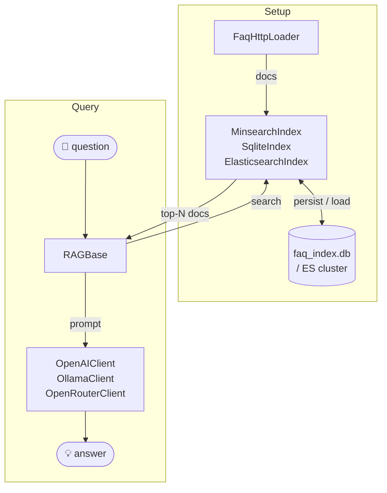

# rag-intro

A minimal Retrieval-Augmented Generation (RAG) project based on [LLM Zoomcamp](https://github.com/DataTalksClub/llm-zoomcamp) module 01-intro. FAQ documents are fetched from the DataTalks.Club API, indexed for full-text search, and used as context for answering questions via an LLM.

## How it works



`RAGBase` depends only on the `SearchIndex` and `LLMClient` protocols — any backend can be swapped without changing the pipeline.

## Project structure

```
rag-intro/
├── src/
│   ├── interfaces.py   # Protocols: SearchIndex, DataLoader, LLMClient
│   ├── ingest.py       # FaqHttpLoader · MinsearchIndex · SqliteIndex · ElasticsearchIndex
│   ├── llm.py          # OpenAIClient · OllamaClient · OpenRouterClient
│   ├── rag.py          # RAGBase — orchestrates search → prompt → answer
│   └── __init__.py     # Re-exports all public classes
├── notebooks/
│   ├── 01_intro.ipynb                    # In-memory demo  (MinsearchIndex + OpenAI)
│   ├── 02_persistent_sqlite.ipynb        # Persistent demo (SqliteIndex + OpenAI)
│   └── 02_persistent_elasticsearch.ipynb # Persistent demo (ElasticsearchIndex + OpenRouter)
├── tests/
│   ├── test_unit.py        # Unit tests (pytest + mocks)
│   └── test_properties.py  # Property-based tests (hypothesis)
├── .env                # Secrets — OPENAI_API_KEY, FAQ_DATA_URL
├── pyproject.toml      # Dependencies & build config (uv / hatchling)
└── uv.lock
```

## Setup

Requires Python 3.11+ and [uv](https://docs.astral.sh/uv/).

```bash
uv sync
cp .env .env.local   # or edit .env directly
```

Set your OpenAI API key in `.env`:

```
OPENAI_API_KEY=sk-...
```

The `FAQ_DATA_URL` defaults to `https://datatalks.club/faq/json/courses.json` and does not need to be changed.

## Usage

### In a script

```python
from src import FaqHttpLoader, MinsearchIndex, RAGBase, OpenAIClient

docs = FaqHttpLoader().load()
index = MinsearchIndex(docs)
rag = RAGBase(index=index, llm=OpenAIClient(), course_filter="llm-zoomcamp")

print(rag.rag("How do I join the course?"))
```

### With a persistent index

```python
from src import FaqHttpLoader, SqliteIndex, RAGBase, OpenAIClient

docs = FaqHttpLoader().load()
index = SqliteIndex(docs=docs, db_path="faq_index.db")  # loads from disk on subsequent runs
rag = RAGBase(index=index, llm=OpenAIClient())

print(rag.rag("What tools do I need?"))
```

### With Ollama (local, no API key needed)

```python
from src import FaqHttpLoader, MinsearchIndex, RAGBase, OllamaClient

docs = FaqHttpLoader().load()
index = MinsearchIndex(docs)
rag = RAGBase(index=index, llm=OllamaClient(), model="llama3")

print(rag.rag("How do I submit homework?"))
```

### Notebooks

```bash
uv run jupyter notebook
```

Open `notebooks/01_intro.ipynb` for the in-memory demo, `notebooks/02_persistent_sqlite.ipynb` for the SQLite-backed demo, or `notebooks/02_persistent_elasticsearch.ipynb` for the Elasticsearch-backed demo.

## Running tests

```bash
# Unit tests
uv run pytest tests/test_unit.py -v

# Property-based tests
uv run pytest tests/test_properties.py -v

# All tests
uv run pytest
```

## Environment variables

| Variable | Required | Default |
|---|---|---|
| `OPENAI_API_KEY` | yes (for OpenAI) | — |
| `FAQ_DATA_URL` | no | `https://datatalks.club/faq/json/courses.json` |

## LLM backends

| Class | Backend | Key env var |
|---|---|---|
| `OpenAIClient` | OpenAI API | `OPENAI_API_KEY` |
| `OllamaClient` | Local Ollama | — |
| `OpenRouterClient` | OpenRouter API | `OPENROUTER_API_KEY` |

## Search backends

| Class | Storage | Notes |
|---|---|---|
| `MinsearchIndex` | In-memory | Fast startup, no persistence |
| `SqliteIndex` | SQLite on disk | Persists between runs, skips re-ingestion if DB exists |
| `ElasticsearchIndex` | Elasticsearch cluster | Requires a running ES instance; call `index_docs()` once to build, then reuse across runs |
